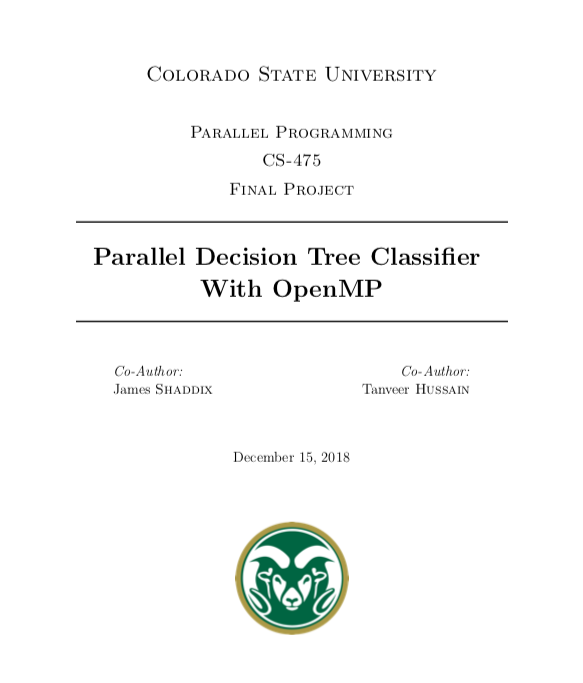

# Parallelized-Decision-Tree
* Authors: james Shaddix, Tanveer Hussain
* This is the final project that we developed for a course in 
Parallel Programming at Colorado State University.

## Prompt
For our assighnment, we were asked to:
1. Download or develop an algorithm.
2. Develop a version of the algorithm that can be easily parallelized.
3. Develop a parallel version of the algorithm.
4. Write a report that explains the runtime behavior that is exhibited from the analysis of your algorithms.

## Description
* For this project, we developed three different versions of the Decision Tree algorithm in C++ and analayzed the performance of each of algorithms using python with Jupyter Notebooks.
* After developing a basic implementation of the decision 
tree algorithm from scratch, we found that we could 
improve the algorithm by reducing the number of 
questions (whose gini impurity is considered) at every node. 
We than developed a Parallelized version of the program using OpenMP.
* Are findings from our analysis are detailed in the report below.

# Paper

[download](report/report.pdf)